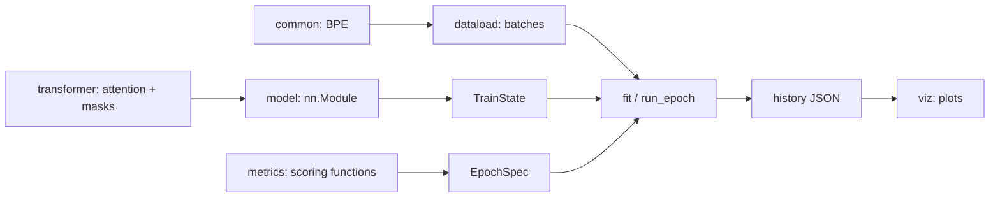
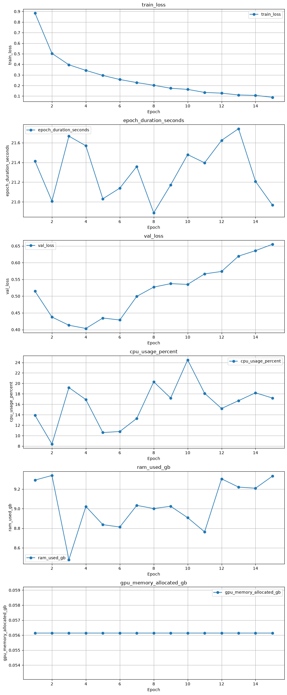

# Dawnshard

**A top-down–designed ML infrastructure library.**

Dawnshard is an ML stack built from first principles and engineered like a real
codebase. Every piece is typed down to tensor shapes, tested, linted,
containerized, and documented with the reasoning behind it.

Most ML code grows bottom-up: a script becomes a notebook becomes a tangle of
globals. Dawnshard goes the other way. Infra is *designed*, with clean seams between
configuration, state, and computation, and this README explains why each seam sits
where it does.

The long-term goal is to build toward **Constitutional AI and RLHF** on top of
this foundation. The training loop, observability, and reproducibility primitives
here are the groundwork for that.

______________________________________________________________________

## Why the name

In Brandon Sanderson's Cosmere, a **Dawnshard** is one of the ancient Commands: a fragment of Adonalsium, the god whose power
shattered into the Shards that now shape every world. Dawnshards are not
weapons or artifacts; they are *access*.

Deep learning is the same idea, expressed in math. A neural network is a mortal
tool for accessing something that looks god-like and magical: the ability to
compress, generalize, and understand patterns at scales no human could process
unaided. The library's name is a reminder to build the infrastructure that lets humans reach for
that kind of power responsibly.

______________________________________________________________________

## A training run in one screen

Here is a complete classification run with a `model`, `train_loader`, and
`val_loader`. The loaders yield `(input, target)` tuples, and the model produces
class logits. The loop itself has no dataset or model class baked in.

```python
train_state = TrainState(
    model=model.to(device=DEVICE),
    optimizer=torch.optim.Adam(params=model.parameters(), lr=1e-3),
    criterion=nn.CrossEntropyLoss(),
)
epoch_spec = EpochSpec(
    device=DEVICE,
    metrics_type=ClassificationMetrics,
    calculate_metrics=calculate_metrics,
    accumulate_metrics=accumulate_metrics,
    reduce_metrics=reduce_metrics,
)
history = fit(
    state=train_state,
    epoch_spec=epoch_spec,
    train_loader=train_loader,
    val_loader=val_loader,
    num_epochs=15,
    val_epoch_list=[5, 10, 15],
    train_seed=random.getrandbits(32),
    val_seed=VAL_SEED,
    test_seed=TEST_SEED,
)
```

Three objects, three jobs:

- `TrainState` is the state: the model, the optimizer, the loss, and an optional
  scheduler.
- `EpochSpec` is the policy: which device, how to score a batch, what to watch.
- `fit` is the mechanism, a function over the two. It returns one `EpochRecord` per
  epoch and writes a history file with the git commit and the machine's CPU, RAM, and
  GPU usage.

That is the entire API. The rest of this page explains why it is built this way.

______________________________________________________________________

## Separate state, policy, and mechanism

This is the principle the whole repo hangs on, and the part I am proudest of.

Operating-systems people have a name for it: **separation of policy and mechanism**,
from the Hydra kernel in 1974. Mechanism is the code that does the work. Policy is
the set of decisions about how. Keep them apart and you can change either without
touching the other. JAX and Flax add the third piece, **explicit state**: the caller
passes the model and optimizer in, rather than hiding them in a trainer instance.
Flax even calls its struct `TrainState`.

Dawnshard applies that split to a PyTorch training loop. State, policy, and mechanism
are visible at the call site, so changing a dataset or model does not require a new
loop.

### State: `TrainState`

Defined in [model.py](app/src/training/train/model.py). A dataclass with four
fields: `model`, `optimizer`, `criterion`, and `scheduler`. It holds the caller-owned
objects the loop changes: model parameters, optimizer state, and an optional
scheduler. A checkpoint saves their `state_dict`s through
[`save_state`](app/src/training/train/utils.py) and restores them through
[`load`](app/src/training/train/train_loop.py). The criterion is supplied again by
the caller; the checkpoint does not save it.

### Policy: `EpochSpec`

Same file. It holds `device`, a `Metrics` type, the three functions that score a
batch and reduce an epoch, and two optional probes. The loop reads it and never
writes to it. Supply `Metrics` and the functions in
[loss_only_metrics.py](app/src/training/metrics/loss_only_metrics.py) to use the same
loop for a regressor. Set `train_probe` to capture gradient norms. Nothing in
`EpochSpec` names the model or dataset it will drive.

### Mechanism: the functions

Defined in [train_loop.py](app/src/training/train/train_loop.py). Every step has the
same signature:

```python
Batch = tuple[Tensor, Tensor]
StepFn = Callable[["TrainState", "EpochSpec", Batch, int, int, Optional[int]], "Metrics"]
```

State in, policy in, data in, metrics out. The trailing ints are the epoch, the
batch's index, and the seed of the pass, passed through for probes: `val_seed` on a
validation pass, `None` on a training pass.

`train_step` and `eval_step` are the two `StepFn`s. `run_epoch` walks a loader with
whichever one it is handed, `fit` runs the epochs and writes the history, and
`profiled_fit` does the same with a profiler on the epochs you pick. None of these
functions owns persistent training state; they change the objects inside `TrainState`
and return metrics or epoch records.

### What that buys you

- **One loop for train and eval.** `run_epoch` takes the step as an argument, so
  `fit` hands it `train_step` for training and `eval_step` for validation. The same
  loop body switches the model's mode, accumulates, and reduces for both.
- **Tests need no `DataLoader`.** `run_epoch` only iterates its loader, so
  [test_train_loop.py](app/tests/test_train_loop.py) passes it a plain list of
  `(input, target)` tuples.
- **The loop has no trainer instance to inspect.** A step's signature names its
  inputs, and [train_loop.py](app/src/training/train/train_loop.py) shows when the
  optimizer steps, metrics accumulate, and probes run.
- **Every piece is replaceable alone.** The MNIST CNN in
  [mnist.py](app/src/training/model/mnist.py) and the AG News transformer in
  [ag_news_classifier.py](app/src/training/model/ag_news_classifier.py) call the same
  `fit`. What changes between them is what goes in: the model, the metrics, a probe,
  and the data. `profiled_fit` changed the mechanism instead, reusing `train_step` and
  `eval_step` untouched.

______________________________________________________________________

## Exactly one place for everything

The split also gives common training extensions a specific home. The loop can keep
its execution path small because each extension crosses a named boundary.

### Metrics: a function of the outputs

A metric calculation sees the predicted tensor and the target tensor. Accuracy,
precision, and recall are one dataclass and three functions in
[classification_metrics.py](app/src/training/metrics/classification_metrics.py).
Mean absolute error would be another dataclass and three more. The step calls the
calculation on each batch; `run_epoch` accumulates and reduces it without knowing
what the fields mean.

### Probes: a function of the training state

A probe sees the model and current batch after a step, while training gradients are
still on the parameters: input, target, detached prediction, epoch, batch index,
and pass seed. It can write to disk or a log and returns nothing. Attention maps,
gradient norms, activations for a fixed input: same signature, same slot on
`EpochSpec`. The signature lives in [model.py](app/src/training/train/model.py).

### Everything else: a named function

- Need a trace? [`profiled_fit`](app/src/training/train/train_loop.py) profiles the
  epochs you select, using the same state, policy, and steps.
- Need to resume? [`save_state`](app/src/training/train/utils.py) and
  [`load`](app/src/training/train/train_loop.py) run where the caller puts them.
- What happened in a run? [`save_history`](app/src/training/train/utils.py) writes
  the records that `fit` builds at the end of the run.
- Who controls randomness? The example entry points seed before model construction,
  and [`fit`](app/src/training/train/train_loop.py) seeds before training. The caller
  passes the validation and test seeds; `fit` forwards the validation seed to
  probes and records all three.

### No hidden complexity

Follow one batch through `train_step`, `run_epoch`, and `fit` in
[train_loop.py](app/src/training/train/train_loop.py). That path shows when a model
runs, when the optimizer steps, and when an optional probe fires. New models and
datasets enter through arguments, while new metrics and probes keep their own
contracts.

______________________________________________________________________

## The repo keeps itself clean

The goal is a codebase with one way to do each thing and a tool that checks it was
done that way. Here is what that looks like.

### The layout enforces the boundaries

The same separation holds one level up. `app/src/training/` has one package per
concern. [test_layout.py](app/tests/test_layout.py) checks the allowed import edges
and rejects cycles, so the training loop cannot acquire a model dependency by
accident.

| Package | Owns |
|---|---|
| `train/` | the loop: `TrainState`, `EpochSpec`, the step functions, `fit`, checkpoints, history and its serialization |
| `metrics/` | the `Metrics` subclasses and their three functions |
| `transformer/` | attention, the encoder block, masks, probes, axis names |
| `common/` | the BPE tokenizer and the indexed max-heap it trains with |
| `dataload/` | dataset caches and the AG News and Multi30k pipelines |
| `model/` | the MNIST classifiers, AG News classifier, and Multi30k predictor |
| `viz/` | every plot |
| `analytics/` | printed dataset statistics |
| `utils/` | the git commit, `log_elapsed` step timing |

Four rules fall out of that layout:

- `train/` never imports `transformer/`, and `transformer/` never imports `train/`:
  the loop doesn't know which model it drives, and attention doesn't know a loop
  exists. The only modules that import both are the models.
- Paths live in one `constants.py`. Device selection lives in one `setup.py`.
- Everything a run produces lands in `app/history/` or `app/datasets/`, both
  gitignored.
- Tests live in `app/tests/`, one file per module. The tests for `mask.py` are in
  `test_mask.py` and nowhere else.

The pieces meet at the training call site. These arrows show what feeds a run,
not Python import direction:



### Every rule has a tool behind it

| Rule | Enforced by |
|---|---|
| Every unsuppressed positional call in `app/src/` fails the named-argument check. | [check_named_args.py](scripts/check_named_args.py) parses calls with `ast`; `# noqa: NAR001` covers APIs that require positional arguments. |
| Every import between packages follows the declared dependency map. | [test_layout.py](app/tests/test_layout.py) checks imports, including type-only imports, and rejects cycles in the map. |
| Every non-test function in `app/src/` has a docstring or an explicit exemption. | [check_docstrings.py](scripts/check_docstrings.py) checks AST definitions; `# noqa: NAR002` marks a deliberate exception. The versioned [pre-commit hook](.githooks/pre-commit) runs it. |
| Every `@jaxtyped(typechecker=beartype)` boundary checks its annotated tensor shapes when called. | The decorators on model `forward` methods and [transformer functions](app/src/training/transformer/functions.py) run the check; [axis names](app/src/training/transformer/constants.py) keep annotations consistent. |
| Every successful `fit` writes run history. | [train_loop.py](app/src/training/train/train_loop.py) calls [save_history](app/src/training/train/utils.py) with the git commit, seeds, state summary, and per-epoch metrics. |
| Every `create-pr` invocation through the Claude Code hook runs the source gates first. | [check_tests_before_pr.py](.claude/hooks/check_tests_before_pr.py) checks named arguments, tests, and README updates when source changes. |

The [Makefile](Makefile) exposes the tests and source checks as stable commands.
`make precheck` also runs pyright, Ruff, and Markdown formatting; its formatter
can rewrite files.

______________________________________________________________________

## Debuggability

A run that goes wrong should be explainable from what it left behind, without running
it again. So every run leaves a trail, and each part of the trail has one job.

### The terminal: one line per epoch

loguru prints the epoch number, the training loss, and the validation loss when
there was a validation pass. That is enough to watch a run from your terminal.

### The history file: everything

Three functions build it:

1. `fit` makes an `EpochRecord` for each epoch: the reduced training metrics, the
   validation metrics if the epoch had a validation pass, the wall-clock duration,
   and a `SystemMetrics` snapshot from psutil and torch with CPU percent, RAM used,
   and peak GPU memory on CUDA or current allocation on MPS.
1. `serialize_epoch_record` flattens that into one dict, hoisting the system fields to
   the top level and dropping anything unset.
1. When `fit` returns, `save_history` writes the records to
   `app/history/<run-uuid>.json` under a `meta` block with the git commit, a summary
   of the `TrainState` (type names, the model's parameter count and the shape of
   every named parameter, and the optimizer's parameter groups, never weights), the
   device, and the run's three seeds.

This is the run the screenshot below comes from, trimmed to its first epoch and
rounded:

```json
{
  "meta": {
    "git_commit": "a408911da11658f59bd1e36d6d4bfb66f7f3b93f",
    "train_state": {
      "model": "AGNewsClassifier",
      "optimizer": {"type": "Adam", "param_groups": [{"lr": 0.001, "betas": [0.9, 0.999], "weight_decay": 0}]},
      "criterion": "CrossEntropyLoss",
      "scheduler": null
    },
    "train_config": {"device": "mps"},
    "seeds": {"train": 2847715383, "val": 1, "test": 2}
  },
  "history": [
    {
      "epoch": 1,
      "train_loss": 0.8845,
      "train_metrics": {"loss": 0.8845, "count": 20000, "correct": 12732, "accuracy": 0.6366, "precision": 0.6359, "recall": 0.6366},
      "val_loss": 0.5147,
      "val_metrics": {"loss": 0.5147, "count": 2000, "correct": 1627, "accuracy": 0.8135, "precision": 0.8145, "recall": 0.8142},
      "epoch_duration_seconds": 21.41,
      "cpu_usage_percent": 13.9,
      "ram_used_gb": 9.29,
      "gpu_memory_allocated_gb": 0.056
    }
  ]
}
```

### Plot it locally

`plot_metrics.py` takes one history file, draws every top-level numeric field against
the epoch, and opens the result in your browser. No server, no account, no upload.

```bash
uv run python app/src/training/viz/plot_metrics.py app/history/fd13cf78-a573-465a-b151-55439ff68d36.json
```



The turn in the validation-loss panel is the overfitting the numbers showed. The flat
duration and memory panels rule out the run changing character halfway through.

### Compare two runs

`compare_runs.py` takes two history files and draws the metrics they share on the
same axes, one colour per run, labelled by file name. This is how a change gets judged:
run before, run after, compare. Both files stay in `app/history/` with the commit
that produced each.

```bash
uv run python app/src/training/viz/compare_runs.py app/history/<run-a>.json app/history/<run-b>.json
```

### Weights & Biases: the same dict, streamed

Pass `wandb_run=` to `fit` and it logs every epoch's dict, the same one that ends up
in the file, with `wandb_run.log` as the epoch finishes. Both outputs use
`serialize_epoch_record`, so their epoch fields match. It is off by default.
`init_wandb` in [setup.py](app/src/training/setup.py) reads `WANDB_API_KEY`; the
example entry points gate it behind flags, and the loop only sees the optional
`wandb_run` argument.

### When the numbers aren't enough

The same loop has two more levels. [Probes](#add-a-probe) capture
whatever you want from inside the model on every batch, and
[`profiled_fit`](#profile-a-few-epochs) writes a Chrome trace of the
epochs you choose, with the dataloader and the step labelled separately.

______________________________________________________________________

## What's inside

| Part | What it is | Where |
|---|---|---|
| Training loop | `fit`, `profiled_fit`, `run_epoch`, `train_step`, `eval_step`; checkpoints, probes, and a history file per run | [train/](app/src/training/train/) |
| Metrics | loss-only; classification with accuracy and macro-averaged precision and recall; masked-token accuracy and perplexity for per-position targets; each as three functions the loop injects | [metrics/](app/src/training/metrics/) |
| Attention | scaled dot-product attention, multi-head self-attention with optional QK norm, fixed sinusoidal position encodings, a pre-norm encoder block, padding and causal masks; design notes and axis names in the [transformer README](app/src/training/transformer/README.md) | [transformer/](app/src/training/transformer/) |
| Tokenizer | byte-level BPE, written from scratch, with an indexed max-heap so each merge updates pair counts in O(log n) | [common/](app/src/training/common/) |
| Data | MNIST through torchvision; AG News and Multi30k sampled, tokenized, and cached; how a `DataLoader` is built in the [dataload README](app/src/training/dataload/README.md) | [dataload/](app/src/training/dataload/), [mnist.py](app/src/training/model/mnist.py) |
| Models | three MNIST classifiers, an AG News transformer classifier, and a Multi30k masked-token predictor | [model/](app/src/training/model/) |
| Visualization | a run's metrics, two runs side by side, a model's autograd graph, attention heatmaps, BPE sequence length against merges | [viz/](app/src/training/viz/) |
| Analytics | BPE length stats (mean, min, max, percentiles) for each Multi30k EN split | [analytics/](app/src/training/analytics/) |
| Tests | a pytest suite; `attention` is checked against `torch.nn.functional.scaled_dot_product_attention` | [tests/](app/tests/) |
| Tutorials | theory and revision notes from tensors to attention masks, published as a website | [tutorials/](tutorials/) |

Logs go through loguru, Weights & Biases is optional, and everything runs with `uv`
locally or in Docker.

______________________________________________________________________

## Using the loop

The sections above say what each piece is and where it lives. This one is the
manual: one subsection per task, each opening with code, then what the loop does with
it. Every snippet assumes a `model`, a `train_loader`, and a `val_loader` whose
batches are `(input, target)` tuples.

### Train and validate

```python
import random

import torch
from torch import nn
from training.constants import TEST_SEED, VAL_SEED
from training.metrics.classification_metrics import (
    ClassificationMetrics,
    accumulate_metrics,
    calculate_metrics,
    reduce_metrics,
)
from training.setup import DEVICE
from training.train.model import EpochSpec, TrainState
from training.train.train_loop import fit
```

With these imports, the three calls in
[A training run in one screen](#a-training-run-in-one-screen) are a complete program.

`fit` runs a training pass every epoch, then steps the scheduler if `TrainState` has
one, then runs a validation pass only if the epoch is in `val_epoch_list`. Both passes
go through the same `run_epoch`, which takes the step function as an argument:
`train_step` for training, and `eval_step`, which runs under `torch.no_grad()`, for
validation. `run_epoch` sets the model's train or eval mode, walks the loader, and
hands each step the epoch number and the batch index.

`fit` returns one `EpochRecord` per epoch and writes the history file, at a path you
can choose with `history_path=`. [Debuggability](#debuggability) shows what the file
holds and how to plot it. To use a learning-rate scheduler, pass `scheduler=` to
`TrainState`. For a model that doesn't classify, import the same three functions from
`training.metrics.loss_only_metrics` and set `metrics_type=Metrics`.

### Seed a run

```python
import random

from training.constants import TEST_SEED, VAL_SEED

train_seed = random.getrandbits(32)
torch.manual_seed(seed=train_seed)  # weight init, which fit is too late to cover
model = MyModel()
...
history = fit(
    state=train_state,
    epoch_spec=epoch_spec,
    train_loader=train_loader,
    val_loader=val_loader,
    num_epochs=15,
    val_epoch_list=[5, 10, 15],
    train_seed=train_seed,
    val_seed=VAL_SEED,
    test_seed=TEST_SEED,
)
```

All three seeds are required, and none of them defaults: a run should say which
random streams it used. The train seed is drawn fresh each run so results are not
read off one lucky draw. The eval seeds are fixed constants so masking can stay
comparable across passes. Seeds control part of a run; exact replay also depends on
the data, tokenizer, model configuration, and execution environment.

The three seeds do three different jobs, and the split is the point:

- **`train_seed` owns the global RNG.** `fit` calls `torch.manual_seed` with it once,
  before the first epoch, so shuffling, dropout, and training collates start from
  the same RNG state for the same setup. One call covers every device: it seeds CPU,
  CUDA, MPS, and XPU. Weight init happens before `fit` ever sees the model, so each
  `main` seeds with the same
  value just before constructing it. Those two calls are the only `torch.manual_seed`
  in `app/src`. Together they control model initialization and the RNG stream inside
  `fit`; they do not cover work the data loader does before those calls.
- **The train seed is drawn fresh for every run.** Each `main` sets
  `train_seed = random.getrandbits(32)` rather than pinning a literal, so no single
  lucky draw gets trained on forever and a result that only holds for one seed shows
  itself. `fit` writes the seed to `meta.seeds`, so its seeded draws can be replayed
  with the same inputs and configuration.
- **`val_seed` and `test_seed` are fixed repo-wide**, as `VAL_SEED` and `TEST_SEED` in
  [constants.py](app/src/training/constants.py), and only `train_seed` varies per run.
  Eval randomness that changes between runs makes `val_loss` incomparable: with masked
  language modelling, a drop from 2.31 to 2.29 could be a better model or an easier
  mask. Fixing the eval seeds takes that term out. The caller passes the constants
  rather than the signature defaulting to them, so a run states every seed it used.
  `fit` does not run a test pass; it only records `test_seed` for the test loader.
- **Only `val_seed` travels.** `fit` hands `train_seed` to nothing but
  `torch.manual_seed`: a training pass passes `seed=None` to its step and probe, and
  any randomness they draw comes from the global RNG that seed set. A validation pass
  gets `val_seed`, threaded by `run_epoch` to the step and on to the probe without
  reseeding anything, so an eval probe can use it for deterministic sampling. The
  train seed controls the loop's RNG stream; the val seed holds validation masking
  steady. A loader's own randomness stays the loader's job; see
  [Random collates](app/src/training/dataload/README.md#random-collates-mask-validation-and-test-once).

All three land in the history file's `meta.seeds`, so a run records its seed choices.

The seed roles are explicit, but the global generator does something worth knowing
before you read a curve. A seed does
not name a value, it selects a stream; every draw moves a position along it. Seeding
twice with the same number does not continue the stream, it returns to position zero:

```
  main()
    │  torch.manual_seed(train_seed)
    ▼
  ┌─────────────────────┐
  │ S(train_seed)  n=0  │ ◄─────────────────────────────────┐
  └──────────┬──────────┘                                   │
             │  Model()                weight init draws    │
             ▼                                              │
  ┌─────────────────────┐                                   │
  │ S(train_seed)  n=k  │  k is set by the architecture     │
  └──────────┬──────────┘                                   │
             │  any other setup draws before fit             │
             ▼                                              │
  ┌─────────────────────┐                                   │
  │ S(train_seed)  n=m  │                                   │
  └──────────┬──────────┘                                   │
             │  fit() calls torch.manual_seed(train_seed) ──┘
             │  the stream rewinds; it does not carry on from n=m
             ▼
  ┌─────────────────────┐
  │ S(train_seed)  n=0  │  every epoch's shuffle, dropout, and collate
  └─────────────────────┘  draws from here on
```

`S(x)` is the stream seeded with `x`, and `n` is how many draws have been taken from
it. Three consequences fall out of that back edge:

- **`fit` starts from the same RNG state for the same `train_seed`.** The rewind
  means draws made during setup do not shift the start of training. With the same
  model, loaders, and data, it replays the same draw sequence. Changing the model
  or loader can change how many draws training consumes, so the same seed alone
  does not make two architectures a controlled comparison.
- **Training replays the draws init just used.** Both start at `n=0` of the same
  stream, so the numbers that set the weights are the numbers that later mask the
  activations. It is harmless in practice, but init and training are not independent
  streams, and anything that assumes they are is wrong here.
- **Two `fit` calls in one process are not independent.** The second rewinds to `n=0`
  as well. Use a different `train_seed` for an independent run.

Workers are covered: a `DataLoader` draws its base seed from this generator, and each
worker derives its own from that, so the rewind reaches them too. See
[the dataload README](app/src/training/dataload/README.md#seeding) for what that means
inside `__getitem__`.

### Repeat a past run

```bash
jq '.meta.seeds' app/history/<run-uuid>.json
# { "train": 2847715383, "val": 1, "test": 2 }
```

```python
train_seed = 2847715383  # from that run's meta.seeds, in place of a fresh draw
```

For the same model and loaders, `fit` starts from the same RNG state, covering
shuffle, dropout, and training-time collate draws. Weight initialization starts
from that seed too when `torch.manual_seed` runs before the model is built.

The recorded seeds are not a complete Multi30k replay recipe. Its loader randomly
reorders training rows before `train_config` chooses the recorded `train_seed`, even
when it keeps all 29,000 rows. The downloaded splits and selected BPE merges are
local cache files, and their identities are not saved in the history. Keep those
inputs and the model configuration alongside the seed to reproduce a past setup.
Validation masks are stable per sentence when the split, tokenizer, and `val_seed`
are the same.

### Add a metric

Subclass `Metrics` and write the three functions. This one tracks mean absolute
error:

```python
from dataclasses import dataclass

from torch import Tensor
from training.train.model import Metrics


@dataclass
class MAEMetrics(Metrics):
    abs_error: float = 0.0


def calculate_mae(predicted: Tensor, target: Tensor) -> MAEMetrics:
    return MAEMetrics(abs_error=(predicted - target).abs().sum().item())


def accumulate_mae(acc: MAEMetrics, batch: MAEMetrics) -> None:
    acc.loss += batch.loss * batch.count
    acc.count += batch.count
    acc.abs_error += batch.abs_error


def reduce_mae(acc: MAEMetrics) -> MAEMetrics:
    if acc.count == 0:
        return MAEMetrics()
    return MAEMetrics(
        loss=acc.loss / acc.count,
        count=acc.count,
        abs_error=acc.abs_error / acc.count,
    )
```

Pass `metrics_type=MAEMetrics`, `calculate_metrics=calculate_mae`, and so on to
`EpochSpec`. The step fills in `loss` and `count` after `calculate_metrics` returns,
so every `Metrics` carries both and `accumulate_mae` still has to add them.
`run_epoch` builds a fresh accumulator each epoch by calling `metrics_type()`, so the
class is its own constructor and there is no init function.

`accumulate_mae` weights each batch's loss by its batch size before averaging, as
[loss_only_metrics.py](app/src/training/metrics/loss_only_metrics.py) and
[classification_metrics.py](app/src/training/metrics/classification_metrics.py) do,
so a smaller last batch doesn't skew the epoch loss.

[masked_token_metrics.py](app/src/training/metrics/masked_token_metrics.py) is for
per-position targets where only some positions are scored and the rest hold
`CROSS_ENTROPY_IGNORE_INDEX`. The batch loss is then a mean over scored positions, not
over rows, so it weights by a `masked` field it counts itself and leaves `count` to the
step. The epoch loss comes out as one mean over every scored position, and
perplexity is its exponential.

`EpochSpec` is generic over its metrics type, written `EpochSpec[M: Metrics]`.
Callable parameters are contravariant, so a function that only accepts `MAEMetrics`
is not a `Callable[[Metrics], ...]`. Without the type parameter, pyright rejects every
spec built from a subclass's functions.

### Add a probe

This probe logs the gradient norm on every `every_n`-th training batch:

```python
from functools import partial
from typing import Optional

from loguru import logger


def log_grad_norm(
    model: nn.Module,
    input_tensor: Tensor,
    target_tensor: Tensor,
    predicted: Tensor,
    epoch: int,
    batch_index: int,
    seed: Optional[int],
    *,
    every_n: int,
) -> None:
    if batch_index % every_n != 0:
        return
    grads = [p.grad.flatten() for p in model.parameters() if p.grad is not None]
    norm = torch.cat(tensors=grads).norm().item()
    logger.info("epoch {} batch {} | grad norm {:.3f}", epoch, batch_index, norm)


epoch_spec = EpochSpec(
    device=DEVICE,
    metrics_type=ClassificationMetrics,
    calculate_metrics=calculate_metrics,
    accumulate_metrics=accumulate_metrics,
    reduce_metrics=reduce_metrics,
    train_probe=partial(log_grad_norm, every_n=100),
)
```

`eval_step` calls `eval_probe` after the forward pass. `train_step` calls
`train_probe` after the optimizer step, while the batch's gradients are still on the
parameters, which is what `log_grad_norm` reads. Both call it as
`probe(model, input, target, predicted, epoch, batch_index, seed)` with a detached
`predicted`, so a probe never costs an extra forward pass. `seed` is `val_seed` on a
validation pass and `None` on a training pass; [Seed a run](#seed-a-run) says why.

A probe keeps no state between calls. It gets `epoch` and `batch_index` every time, so
one that only wants the first batch checks `batch_index == 0`. Settings such as
`every_n` or an output folder are bound with `functools.partial`.

A probe returns nothing. What it keeps goes to disk or to the log, never back through
`run_epoch`, so `fit` still returns only metrics and memory doesn't grow with the
number of epochs. Reading the results is a separate function you call after `fit`.

A probe that needs values from inside `forward` reads them off the model, because
`forward` has to keep returning only what the criterion expects. `AGNewsClassifier`
stores each block's detached attention weights in `model.attention_map`, which keeps
one batch of weights per block on the device between calls. `save_attention_maps` in
[probes.py](app/src/training/transformer/probes.py) writes them to disk, and
[Visualizing attention](#visualizing-attention) plots them.

### Profile a few epochs

```python
from training.train.train_loop import profiled_fit

profiled_fit(
    state=train_state,
    epoch_spec=epoch_spec,
    train_loader=train_loader,
    val_loader=val_loader,
    num_epochs=5,
    val_epoch_list=[5],
    profile_epoch_list=[2],
    train_seed=random.getrandbits(32),
    val_seed=VAL_SEED,
    test_seed=TEST_SEED,
)
```

`profiled_fit` takes `fit`'s arguments plus `profile_epoch_list`. On those epochs it
wraps the training pass in `torch.profiler.profile`, labels the dataloader and step
phases, and writes a Chrome trace to `app/history/traces/<run-uuid>/epoch_N.json` for
`chrome://tracing` or Perfetto. Validation passes aren't profiled. Profiling epoch 2
rather than 1 keeps one-time startup costs out of the trace.

It writes the normal history file and a second `<run-uuid>_detailed.json`, in which
the profiled epochs also carry dataloader and step CPU time, CUDA time on a GPU, and
the trace path.

Profiling is its own function rather than a flag on `fit` for two reasons. The
profiler slows down every step it records, so you pick which epochs pay for it. And
the regular history file keeps `fit`'s format, so profiled runs compare directly with
normal ones.

### Save and restore a checkpoint

```python
from training.constants import CHECKPOINTS_PATH
from training.train.train_loop import load
from training.train.utils import save_state

checkpoint_path = CHECKPOINTS_PATH / "model.pt"
checkpoint_path.parent.mkdir(parents=True, exist_ok=True)
save_state(state=train_state, checkpoint_path=checkpoint_path)
load(state=train_state, epoch_spec=epoch_spec, checkpoint_path=checkpoint_path)
```

`save_state` writes the model, optimizer, and scheduler `state_dict`s, and `load`
restores them into an existing `TrainState`, so build the model and optimizer first.
`save_state` doesn't create the folder, hence the `mkdir`. `fit` calls neither, so a
checkpoint happens exactly where you put the call.

______________________________________________________________________

## The BPE tokenizer

The tokenizer is byte-pair encoding, written from scratch. It works on UTF-8 bytes, so
any text can be encoded without an unknown token. It splits text with GPT-4's
pre-tokenization pattern first, and merges never cross those chunks. Usage lives in
[common/README.md](app/src/training/common/README.md).

```python
from common import bpe

merges, vocab = bpe.train(text=corpus, num_merges=2000)
ids = bpe.encode(text="Stocks rally as tech earnings beat forecasts", merges=merges)
```

On the AG News train split, 2,000 merges bring the average sample down from 236 bytes
to 79 tokens.

______________________________________________________________________

## Getting started

### Install

Dawnshard uses [`uv`](https://docs.astral.sh/uv/) for its Python workflows.
Install it first, then make the project environment file available to `uv run`:

```bash
# Make `uv run` automatically load the project .env (which sets PYTHONPATH=app/src)
export UV_ENV_FILE=".env"
```

Set `WANDB_API_KEY` only if you enable W&B. Set `DOCKER_BUILDKIT=1` for the
cached Docker builds below. Then sync the pinned dependencies:

```bash
uv sync --frozen          # runtime + dev dependencies
uv sync --frozen --no-dev # runtime only (matches the production Docker image)
```

`UV_ENV_FILE=".env"` is what makes imports like `from training.train.train_loop import fit`
resolve. [.env](.env) sets `PYTHONPATH=app/src`, and `uv run` loads it for every
command.

### Run something

Everything runs through `uv run`, never a bare `python`. With `UV_ENV_FILE` set,
`PYTHONPATH=app/src` is loaded automatically.

```bash
# Train the transformer classifier on AG News, saving attention maps as it goes
uv run python app/src/training/model/ag_news_classifier.py

# Train the MNIST model (CNN by default — edit main() to pick a model)
uv run python app/src/training/model/mnist.py

# Run the Multi30k masked-token predictor's configured sweep (50 epochs per config)
uv run python app/src/training/model/multi30ken_predictor.py

# Plot one run's per-epoch metrics
uv run python app/src/training/viz/plot_metrics.py app/history/<run-id>.json

# Compare two runs on the same axes
uv run python app/src/training/viz/compare_runs.py app/history/<run-a>.json app/history/<run-b>.json

# Plot mean BPE tokens per sample against the number of merges (AG News train)
uv run python app/src/training/viz/bpe_seq_len.py

# Print BPE length stats (mean, min, max, percentiles) for each Multi30k EN split
uv run python app/src/training/analytics/multi30ken_bpe_len.py

# Run the test suite
make test
```

**Device selection is automatic** ([setup.py](app/src/training/setup.py)): CUDA → MPS →
CPU, in that order. Force CPU with `DISABLE_GPU=1`.

### Weights & Biases is optional

W&B logging is **off by default**. `main()` in [mnist.py](app/src/training/model/mnist.py)
gates it behind `SHOULD_LOG_WANDB = False`, and `fit(...)` simply skips logging when
no run is passed. To enable it, set `WANDB_API_KEY` and flip the flag. To stay fully
offline, leave the flag `False` (or run `wandb disabled` / `export WANDB_MODE=disabled`).

### The three MNIST models

All three share the same `(batch, 1, 28, 28) → (batch, 10)` signature and are
swappable in `main()` ([mnist.py](app/src/training/model/mnist.py)):

| Model | Architecture |
|---|---|
| `MNISTClassifier` | Flatten → 784→128 → ReLU → 128→64 → ReLU → 64→10 |
| `DeepMNISTClassifier` | Flatten → 784→256 → ReLU → 256→128 → ReLU → 128→10 |
| `ConvolutionalMNISTClassifier` | Conv(1→16) → Pool → Conv(16→32) → Pool → Linear→10 |

### Visualizing a model's graph

[model_graph.py](app/src/training/viz/model_graph.py) renders the autograd graph
(`torchviz`) to an HTML file and opens it in your browser:

```python
from training.model.mnist import ConvolutionalMNISTClassifier
from training.viz.model_graph import visualize_model

visualize_model(model=ConvolutionalMNISTClassifier(), input_shape=(1, 1, 28, 28))
```

For a quick layer-by-layer parameter table, `torchinfo.summary(...)` is the
faster check. See the module docstring for both.

### Visualizing attention

[attention_heatmap.py](app/src/training/viz/attention_heatmap.py) saves one layer's attention
weights as a grid of heatmaps, with one row per sentence and one column per head. All
cells share a single colour scale so heads can be compared, padding is dropped, and
spaces are drawn as `·` so word boundaries stay visible.

The AG News classifier records these maps during training with a probe:

1. Every `AGNewsClassifier.forward` overwrites `model.attention_map` with each block's
   detached `(B, h, L, L)` weights.
1. `main` sets `eval_probe=partial(save_attention_maps, out_dir=..., num_sentences=4)`
   ([probes.py](app/src/training/transformer/probes.py)), with `out_dir` a fresh folder
   under `app/history/attention_probes/` (`ATTENTION_PROBES_PATH` in
   [constants.py](app/src/training/constants.py)).
1. On each validation epoch, `save_attention_maps` ignores every batch except
   batch 0 and saves its first 4 sentences to `epoch_<NNN>.pt`. Each file holds the
   token ids and one weight tensor per block.
1. After `fit`, `plot_attention_probes` reads those files and writes
   `epoch_<NNN>_block_<i>.png` next to each one.

The validation loader isn't shuffled, so every capture shows the same sentences and
you can compare how attention changes between epochs.

### Docker

The [Dockerfile](Dockerfile) copies `uv` from the official image, uses a BuildKit
cache mount for fast rebuilds, and supports a `DEV` build arg to include or
exclude dev dependencies. Prod/dev parity is the point: the same
`uv sync --frozen` runs everywhere.

```bash
make docker-build           # production image (runtime deps only)
make docker-build-dev       # dev image (adds pytest, ruff, pyright, …)
make docker-run             # shell in the prod image
make docker-run-dev         # shell in the dev image, ./app mounted for live editing
make docker-build-dev-test  # build dev image and run the test suite inside it
```

(Remember `export DOCKER_BUILDKIT=1` so the cache mount is honored.)

### Make targets

The [Makefile](Makefile) is the single source of truth for common workflows, so
you never have to remember the underlying flags:

| Target | What it does |
|---|---|
| `make test` | Run pytest (`make test DIR=app/tests/foo` to scope it) |
| `make precheck` | `pyright` + `ruff check --fix` + `ruff format` + `mdformat`. Run it before every PR |
| `make check-named-args` | Enforce the keyword-argument rule (see [CLAUDE.md](CLAUDE.md)) |
| `make check-docstrings` | Enforce the docstring rule (see [CLAUDE.md](CLAUDE.md)) |
| `make install-hooks` | Install the versioned docstring pre-commit check (once after cloning) |
| `make docker-build*` / `make docker-run*` | Build and run the Docker images (above) |
| `make nb-to-py NB=…` / `make py-to-nb PY=…` | Convert between notebooks and scripts |

______________________________________________________________________

## Tutorials

The [tutorials/](tutorials/) directory explains the theory behind the code as
revision notes. Its [guide](tutorials/index.md) offers question-led revision
routes, a page list, and a map from specific questions to the sections that
answer them. Pages begin with the central idea and end with a quick recall check;
the longer derivations remain available when you need them.

- [tutorials/pytorch/](tutorials/pytorch/) — a PyTorch series: tensors, shapes and
  broadcasting, autograd and gradient descent, `nn.Module` and multi-layer
  networks, where the transpose in a linear layer's backward pass comes from, ReLU
  and dead neurons, data loading, and best practices for inspecting a model.
- [tutorials/training/](tutorials/training/) — the training loop, optimizers and
  learning-rate schedulers, Adam and the learning rate, and what the training loop
  measures for free versus a profiler.
- [tutorials/math/](tutorials/math/) — the matrix calculus behind backprop, adapted
  from Parr & Howard with PyTorch checks.
- [tutorials/vision/](tutorials/vision/) — convolutional networks for MNIST.
- [tutorials/transformer/](tutorials/transformer/) — attention masks and
  cross-attention, pre-norm vs post-norm, and compute and memory planning.

The project landing page and tutorials are built as a website at
[anantsimran.github.io/dawnshard](https://anantsimran.github.io/dawnshard/) by
[pages.yml](.github/workflows/pages.yml) on pushes to `main`. The landing page is a
hand-written hero with this README rendered below it, so the hero's links land on
real sections. Tutorial paths mirror the repo, and source-file links
point to GitHub. In the repository's **Settings → Pages → Build and deployment**,
the publishing source must be **GitHub Actions**; branch publishing runs a separate
Jekyll build that can replace the MkDocs site.

**When you add or change a tutorial, update
[tutorials/index.md](tutorials/index.md), and add a line for a new page to the `nav:`
list in [mkdocs.yml](mkdocs.yml).** Otherwise the page is built but doesn't appear in the
site's navigation. The build prints a warning naming any page left out. To preview
the site locally:

```bash
uvx --from mkdocs==1.6.1 --with mkdocs-material==9.7.7 --with pymdown-extensions==12.0 mkdocs serve
```

______________________________________________________________________

## Project structure

```
dawnshard/
├── app/
│   ├── src/
│   │   └── training/
│   │       ├── train/                # the functional training loop
│   │       │   ├── model.py          # TrainState, EpochSpec, Metrics, Probe, EpochRecord, SystemMetrics
│   │       │   ├── train_loop.py     # fit/profiled_fit/run_epoch/step
│   │       │   ├── environment.py    # per-epoch CPU/RAM/GPU snapshot
│   │       │   ├── serialization.py  # TrainState, EpochSpec, EpochRecord → history-JSON dicts
│   │       │   └── utils.py          # save_state, save_history
│   │       ├── metrics/              # Metrics subclasses + calculate/accumulate/reduce functions
│   │       ├── transformer/          # attention built from scratch
│   │       │   ├── README.md         # attention design choices and axis names
│   │       │   ├── functions.py      # scaled dot-product attention
│   │       │   ├── modules.py        # SinusoidalEmbedding, MultiHeadAttentionLayer (optional QK norm), EncoderBlock
│   │       │   ├── probes.py         # save_attention_maps: probe that saves attention maps per epoch
│   │       │   ├── mask.py           # padding and causal keep masks, pad-masked mean pool
│   │       │   └── constants.py      # axis names for shape strings: B, L, D_MODEL, H, D_K
│   │       ├── common/
│   │       │   ├── README.md         # BPE usage: batching, saving, translation, chunking
│   │       │   ├── bpe.py            # byte-level BPE with GPT-4 pre-tokenization
│   │       │   ├── constants.py      # protected token ids: PAD, MASK, CLS, SEP
│   │       │   └── priority_queue.py # indexed max-heap with O(log n) priority updates
│   │       ├── dataload/             # dataset caches and text pipelines
│   │       │   ├── README.md         # DataLoader internals: collate, shuffling, seeding, chunks
│   │       │   ├── ag_news.py        # AG News: sample, tokenize, cache, one DataLoader per split
│   │       │   ├── multi30ken.py     # Multi30k English: tokenize and mask language-model batches
│   │       │   └── constants.py      # DATASETS_CACHE_DIR
│   │       ├── model/                # MNIST, AG News, and Multi30k model entry points
│   │       │   ├── mnist.py                # three digit classifiers
│   │       │   ├── ag_news_classifier.py   # text classifier and attention probe
│   │       │   └── multi30ken_predictor.py # masked-token predictor and config sweep
│   │       ├── viz/                  # metrics, run comparison, model graph, attention, BPE length
│   │       ├── analytics/            # printed stats: Multi30k EN BPE length percentiles
│   │       ├── utils/                # git commit, log_elapsed timing
│   │       ├── setup.py              # device selection + wandb init
│   │       └── constants.py          # repo-root-relative paths (CHECKPOINTS_PATH, HISTORY_PATH, TRACES_PATH, ATTENTION_PROBES_PATH)
│   ├── tests/                    # pytest suite; test_layout.py checks imports between packages
│   ├── history/                  # per-run history JSON; traces/ and attention_probes/ (gitignored)
│   └── datasets/                 # downloaded dataset cache (gitignored)
├── tutorials/                    # theory and revision: pytorch/, training/, math/, vision/, transformer/; index.md
├── experiments/                  # run write-ups with the CSV exports and plots behind them
├── pages/                        # MkDocs hooks and theme overrides for the website
├── scripts/
│   ├── check_named_args.py       # keyword-argument linter
│   └── check_docstrings.py       # docstring-presence linter
├── .claude/hooks/                # pre-PR gate: named args, tests, README touched when source changed
├── .githooks/pre-commit          # runs the docstring check (make install-hooks)
├── .github/workflows/pages.yml   # builds and deploys the website on push to main
├── mkdocs.yml                    # website config and navigation
├── Dockerfile                    # uv-based prod/dev image
├── Makefile                      # test / precheck / lint / docker / notebook targets
├── pyproject.toml                # deps, ruff, pyright, pytest config
└── .env                          # PYTHONPATH=app/src (loaded via UV_ENV_FILE)
```
