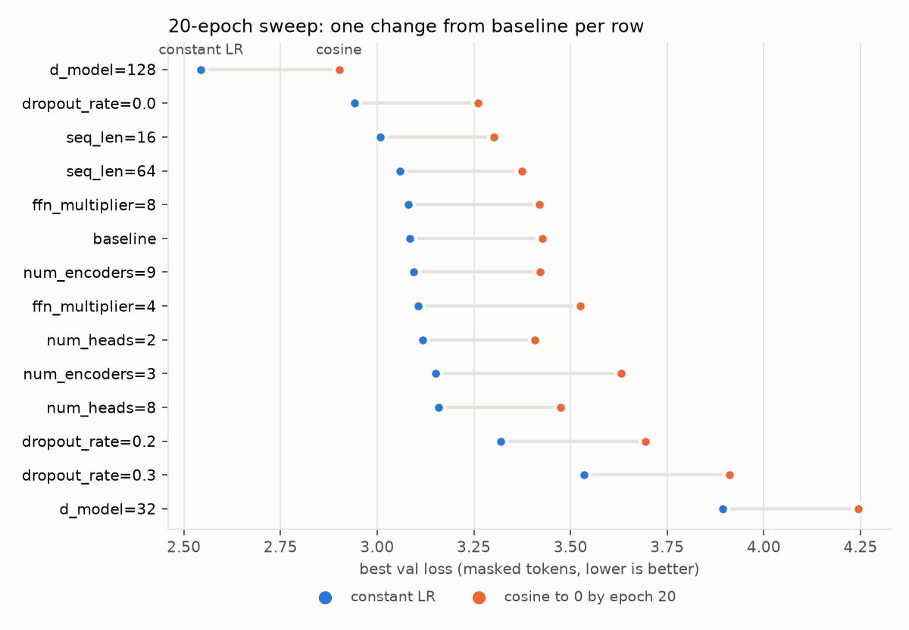
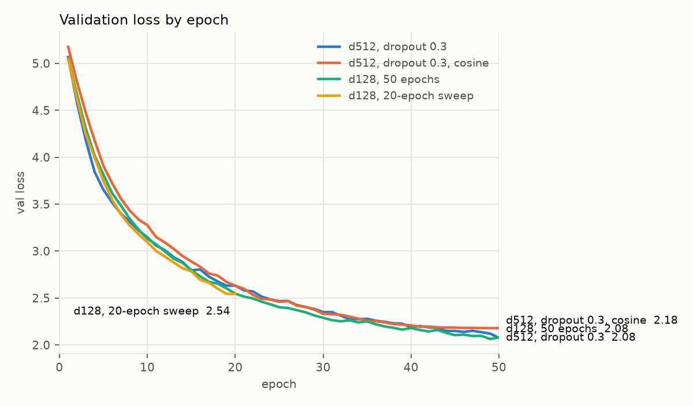
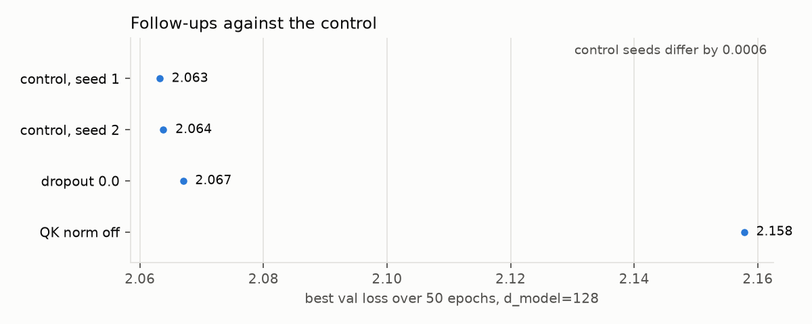

# Multi30k masked-token pretraining: a sweep and four follow-ups

`Multi30kEnPredictor` is a pre-norm encoder trained with BERT-style masking on the
English side of Multi30k. This page records 34 training runs made on 2026-09-29: a
28-run sweep over six hyperparameters and cosine annealing, two 512-wide runs over 50
epochs, and four follow-ups at `d_model=128` over 50 epochs. Every number below comes
from [multi30ken_mlm_runs.csv](multi30ken_mlm_runs.csv) and
[multi30ken_mlm_epochs.csv](multi30ken_mlm_epochs.csv), exported from the runs'
history files.

The short version: **training length mattered most, then width, then QK norm.** A
2.2M-parameter model trained for 50 epochs matches a 27.5M-parameter one.

______________________________________________________________________

## Results at a glance

| Run | Params | Epochs | Best val loss | Perplexity | Masked-token accuracy |
|---|---|---|---|---|---|
| Baseline (`d_model=64`) | 0.69M | 20 | 3.085 | 21.9 | 40.7% |
| Best of the sweep (`d_model=128`) | 2.16M | 20 | 2.544 | 12.7 | 48.5% |
| `d_model=512`, dropout 0.3 | 27.5M | 50 | 2.075 | 8.0 | 55.9% |
| `d_model=512`, dropout 0.3, cosine | 27.5M | 50 | 2.179 | 8.8 | 54.5% |
| **`d_model=128`, 50 epochs (mean of 2 seeds)** | **2.16M** | **50** | **2.064** | **7.9** | **56.2%** |

- **Longer training beat a 13× larger model.** The 50-epoch `d_model=128` control
  (2.063 and 2.064 over two seeds) finishes level with the 27.5M-parameter
  `d_model=512` run (2.075).
- **Width is the only architecture knob that moved the sweep.** `d_model=128` beat
  the baseline by 0.54. Changing depth, head count, or FFN width moved it by 0.08 at
  most.
- **Cosine annealing lost every time**, 14 pairs out of 14 at 20 epochs and at
  `d_model=512` over 50.
- **QK norm helps.** Turning it off costs 0.095, 150 times the gap between the two
  control seeds.
- **No run had converged.** All 34 runs reached their best val loss in their last two
  epochs.

______________________________________________________________________

## Setup

### Task and data

The loader, [multi30ken.py](../app/src/training/dataload/multi30ken.py), tokenizes
Multi30k's English sentences with the repo's byte-level BPE (2,000 merges, a
2,260-token vocabulary) and pads or truncates each to `seq_len`. It selects 15% of the
non-protected tokens for prediction and follows BERT's 80/10/10 rule: 80% become
`MASK_ID`, 10% become a random token, 10% stay unchanged.

- **Train:** 29,000 sentences, with masks redrawn every batch.
- **Val:** 1,014 sentences, masked with a fixed seed per sentence, so every run and
  every epoch scores the same 2,532 positions (at `seq_len=32`).
- **Loss:** cross-entropy over the selected positions only. Perplexity is its
  exponential, and accuracy is top-1 over the same positions
  ([masked_token_metrics.py](../app/src/training/metrics/masked_token_metrics.py)).

### Model

[multi30ken_predictor.py](../app/src/training/model/multi30ken_predictor.py): token
embedding, dropout, fixed sinusoidal positions, a stack of pre-norm `EncoderBlock`s,
a final LayerNorm, and a linear head to the vocabulary. The baseline is
`d_model=64`, `seq_len=32`, dropout 0.1, 6 blocks, 4 heads, an FFN 6× `d_model` wide,
and QK norm on.

### Training

Adam at a learning rate of `1e-3`, batch size 64, no warmup and no weight decay. With
cosine annealing on, `CosineAnnealingLR` decays the learning rate to 0 over the run's
full length. All runs trained on an Apple-silicon GPU (MPS). Every run drew its own
train seed, recorded in its history file.

______________________________________________________________________

## 1. The 20-epoch sweep

Each row changes one setting from the baseline, trained once with a constant learning
rate and once with cosine annealing: 14 configurations, 28 runs.

| Change from baseline | Params | Best val (constant LR) | Perplexity | Accuracy | Best val (cosine) | Train time per epoch |
|---|---|---|---|---|---|---|
| `d_model=128` | 2.16M | 2.544 | 12.7 | 48.5% | 2.901 | 19 s |
| `dropout_rate=0.0` | 0.69M | 2.941 | 18.9 | 43.0% | 3.260 | 11 s |
| `seq_len=16` | 0.69M | 3.008 | 20.2 | 42.7% | 3.303 | 9 s |
| `seq_len=64` | 0.69M | 3.058 | 21.3 | 41.6% | 3.373 | 21 s |
| `ffn_multiplier=8` | 0.79M | 3.081 | 21.8 | 41.5% | 3.418 | 11 s |
| baseline | 0.69M | 3.085 | 21.9 | 40.7% | 3.427 | 11 s |
| `num_encoders=9` | 0.89M | 3.095 | 22.1 | 41.1% | 3.422 | 14 s |
| `ffn_multiplier=4` | 0.59M | 3.105 | 22.3 | 41.0% | 3.526 | 10 s |
| `num_heads=2` | 0.69M | 3.118 | 22.6 | 40.3% | 3.408 | 10 s |
| `num_encoders=3` | 0.49M | 3.151 | 23.4 | 40.6% | 3.632 | 7 s |
| `num_heads=8` | 0.69M | 3.158 | 23.5 | 40.6% | 3.474 | 14 s |
| `dropout_rate=0.2` | 0.69M | 3.320 | 27.7 | 38.1% | 3.693 | 11 s |
| `dropout_rate=0.3` | 0.69M | 3.535 | 34.3 | 36.1% | 3.910 | 11 s |
| `d_model=32` | 0.25M | 3.893 | 49.1 | 32.9% | 4.243 | 9 s |

### What it shows

- **Width sets the ceiling.** Quadrupling `d_model` from 32 to 128 moves val loss from
  3.89 to 2.54, the largest spread in the sweep. Spending the same kind of budget on
  depth (`num_encoders=9`, +0.20M parameters) or FFN width (`ffn_multiplier=8`,
  +0.10M) changes nothing measurable.
- **Every run was cut off early.** All 28 runs reached their best val loss at epoch
  19 or 20. Less dropout is better at this length (0.0 → 0.1 → 0.2 → 0.3 gives
  2.94 → 3.08 → 3.32 → 3.53) because a model that hasn't finished learning has
  nothing to regularize yet.
- **Cosine loses because the schedule is too short.** It decays the learning rate to
  0 by epoch 20 while the constant-LR run is still improving, so it gives up the
  progress the last epochs would have made. This says nothing about cosine on a
  schedule long enough to converge.

### What it doesn't show

- **Differences under about 0.08 from the baseline are not established.** Each
  sweep configuration ran once. Depth, head count, FFN width, and `seq_len=64` all
  land within 0.08 of the baseline and could be noise. (The 50-epoch follow-ups
  measured a seed gap of 0.0006, but that is one pair of seeds at a different width
  and length, so it isn't carried back here.)
- **`seq_len=16` is not a better setting.** It truncates longer sentences, so its val
  loss covers fewer, earlier positions than the others and isn't comparable.

______________________________________________________________________

## 2. Two 512-wide runs over 50 epochs

The sweep pointed at width and at training longer, so the next runs did both at once:
`d_model=512` (27.5M parameters), dropout raised to 0.3 against overfitting, 50
epochs, once with a constant learning rate and once with cosine annealing.

| Run | Best val | Best epoch | Perplexity | Accuracy | Final train | Final val | Train time per epoch |
|---|---|---|---|---|---|---|---|
| `d_model=512`, dropout 0.3 | 2.075 | 50 | 8.0 | 55.9% | 2.008 | 2.075 | 129 s |
| `d_model=512`, dropout 0.3, cosine | 2.179 | 49 | 8.8 | 54.5% | 2.099 | 2.179 | 124 s |

- **The constant-LR run was still improving at epoch 50**, by about 0.07 every 5
  epochs.
- **Cosine lost here too, for the same reason as in the sweep.** The two runs were
  level through epoch 30 (cosine 2.33, constant 2.35). After that the decaying learning rate
  slowed the cosine run, which finished 0.10 behind.
- **This run alone can't separate width from training length.** At epoch 20 it was at
  2.632, slightly behind the 20-epoch `d_model=128` sweep run's 2.544. Control A in
  the next section separates the two.

______________________________________________________________________

## 3. Follow-ups at `d_model=128` over 50 epochs

Four runs at `d_model=128`, dropout 0.1, constant learning rate, 50 epochs. The
control ran twice, so the gap between its two seeds gives a sense of how large a
difference has to be before it counts.

| Run | Params | Best val | Δ vs control | Perplexity | Accuracy | Final train | Final val |
|---|---|---|---|---|---|---|---|
| Control, seed 1 | 2.16M | 2.0632 | | 7.87 | 56.0% | 2.051 | 2.081 |
| Control, seed 2 | 2.16M | 2.0638 | | 7.88 | 56.4% | 2.039 | 2.064 |
| Dropout 0.0 | 2.16M | 2.0670 | +0.004 | 7.90 | 56.8% | 1.724 | 2.073 |
| QK norm off | 2.16M | 2.1578 | +0.095 | 8.65 | 54.8% | 2.107 | 2.158 |

Δ is against the mean of the two control seeds (2.0635).

### What they show

- **Training length, not width, produced the 512 run's result.** The control reaches
  2.063 with 2.16M parameters, level with the 27.5M-parameter 512 run's 2.075, and
  trains an epoch in 19 s instead of 129 s. The 512 run did use dropout 0.3 rather
  than 0.1, so the match isn't exact, but nothing here shows that the extra width
  buys anything at this data size.
- **QK norm is worth keeping.** Without it the model is 0.095 worse, and its training
  loss is worse too (2.107 against about 2.045). That points to harder optimization,
  not to less overfitting. QK norm costs 384 parameters.
- **Dropout 0.0 matches the control on val loss but is overfitting.** Its train/val
  gap grows every epoch: 0.004 at epoch 10, then 0.13, 0.22, 0.28, and 0.35 at epoch
  50, while val loss still falls. Dropout 0.1 keeps pace on val loss without that
  gap, which makes it the safer setting for longer runs. (The control's own gap
  can't be read the same way, because its train loss is measured with dropout
  active, which inflates it.)

### What they don't show

- **Two seeds are one sample of the noise.** The 0.0006 gap is reassuring, not a
  measured variance. The QK-norm effect is large enough to survive a much bigger
  spread. The dropout-0.0 result (+0.004) is not established either way.
- **These are single choices at one width and length.** QK norm was tested at
  `d_model=128` over 50 epochs only.

______________________________________________________________________

## Next runs

In order of what they would settle:

1. **Train the control longer.** Every run was still improving at its last epoch. Run
   `d_model=128`, dropout 0.1 for 100 to 150 epochs, and stop on val loss.
1. **Retry cosine on a converging schedule**, with the same length as above and a
   short warmup, so the comparison isn't decided by a schedule that ends too early.
1. **Rerun the sweep's close calls with 3 seeds each**: depth, head count, FFN width,
   and `seq_len=64`.

______________________________________________________________________

## Data and reproducing

### Files

- [multi30ken_mlm_runs.csv](multi30ken_mlm_runs.csv): one row per run (34 rows). It
  has the experiment, the full config, epochs, parameter count, train seed, best val
  loss with its epoch, perplexity, and accuracy, the final train and val loss, the
  mean train time per epoch, and the commit the history file recorded.
- [multi30ken_mlm_epochs.csv](multi30ken_mlm_epochs.csv): one row per epoch per run
  (860 rows). It has train loss, val loss, val perplexity, val accuracy, and train
  time. Join it to the runs file on `run_id`.
- `app/history/<run_id>.json`: the full history file for each run, including
  attention captures under `app/history/attention_probes/<run_id>/`. These are
  gitignored and exist only on the machine that trained them.

The `experiment` column groups the runs: `sweep_20ep` (28), `single_512` (1),
`single_512_cosine` (1), and `follow_up_128_50ep` (4).

### Code

The sweep and the two 512 runs ran the code in `fc84c69`. The follow-ups need an
option added afterwards and not yet committed: the `qk_norm` field on `Config`. To
rerun:

- **The sweep:** set `SHOULD_GRID_SEARCH = True` and call
  `grid_search(configs=one_at_a_time_configs(baseline=BASELINE, sweep=SWEEP), num_epochs=NUM_EPOCHS)`.
- **The follow-ups:** set `SHOULD_GRID_SEARCH = True`, which runs `FOLLOW_UP` for
  `FOLLOW_UP_EPOCHS`.
- **The 512 runs:** set `SHOULD_GRID_SEARCH = False`, which trains `SINGLE_RUN` for
  `SINGLE_RUN_EPOCHS`. Toggle `cosine_annealing` in `SINGLE_RUN` for the second run.

Then run `uv run python app/src/training/model/multi30ken_predictor.py` from the repo
root. Use `caffeinate -is` on macOS, because training pauses whenever the machine
sleeps.

### Known issues in the recorded data

- **The first four sweep runs record the wrong commit.** `fit` reads `HEAD` when a run
  finishes, and HEAD moved during a branch rewrite while those runs trained. Runs
  `4be95609`, `aed0912f`, `65f86ab7`, and `0a87c21d` record `bd25f8f`, `1f64215`, or
  `d2b56de`. They actually ran the same model, loader, and metrics code as
  `fc84c69`. The follow-ups record `306bafd`, which doesn't contain the `qk_norm`
  option they used.
- **Wall-clock times are longer than the per-epoch times suggest.** The machine slept
  several times during the sweep. The recorded epoch durations exclude the sleep, but
  the log timestamps don't.
